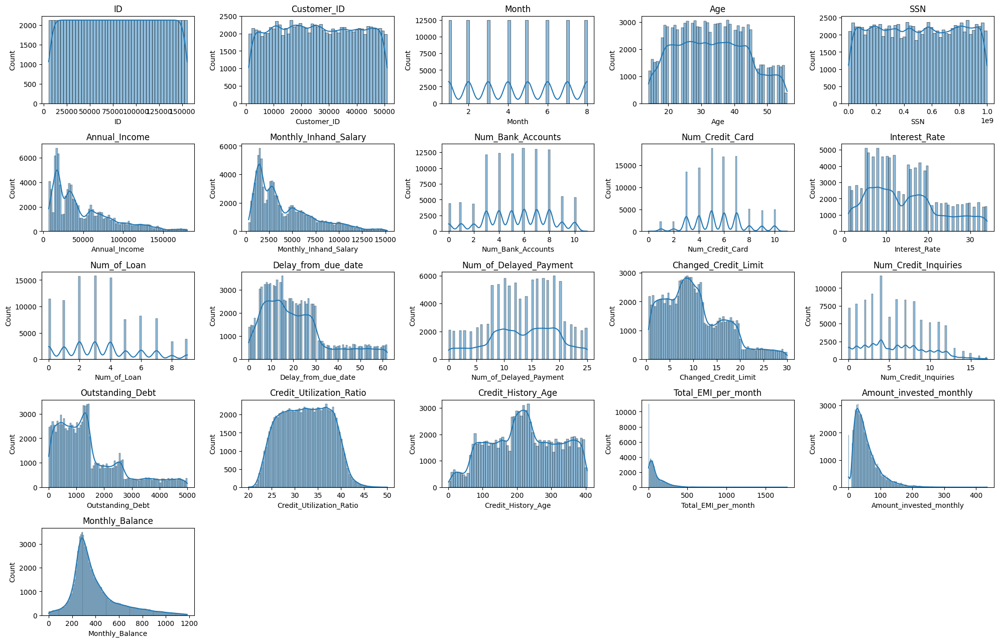
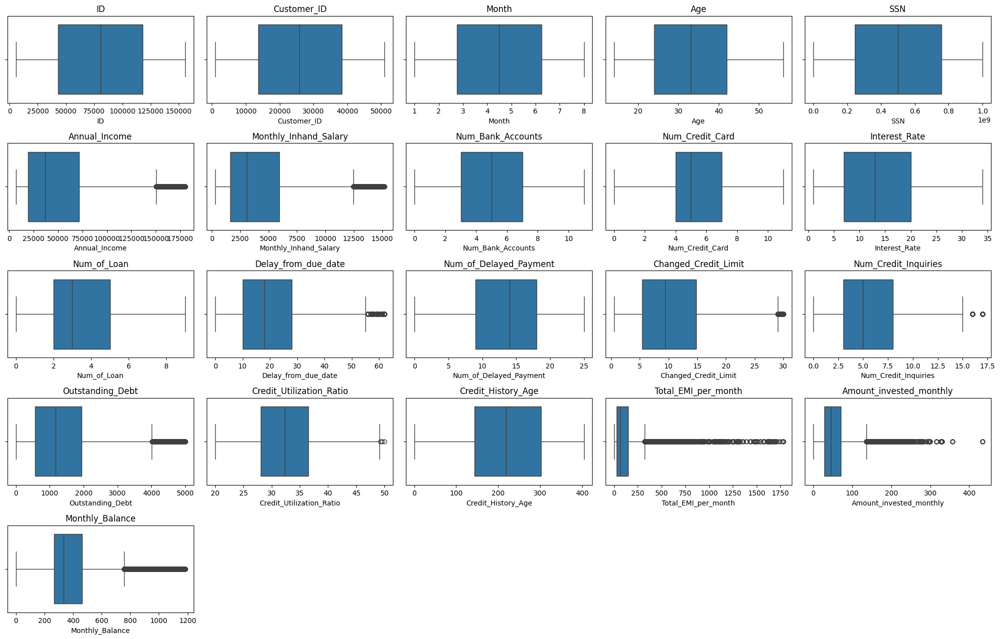
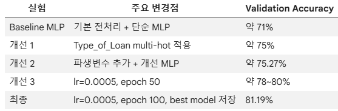
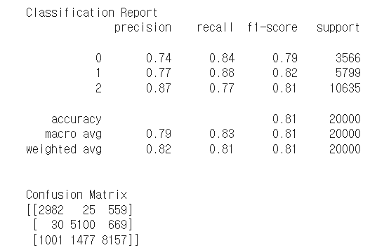

# Deep Learning Competition - Credit Score Classification

## 프로젝트 개요

고객의 금융 정보를 바탕으로 `Credit_Score`를 예측하는 다중분류 프로젝트입니다.  
수치형 변수와 범주형 변수가 함께 존재하는 정형 데이터를 활용했으며, 최종 모델은 개선된 MLP 구조를 사용했습니다.

---

## 사용 데이터

- Kaggle Credit Score Classification Dataset
- Target: `Credit_Score`
- Task: Multi-class Classification

---

## EDA

### 1. 수치형 변수 분포 확인

수치형 변수의 histogram을 통해 금액형 변수에서 오른쪽으로 긴 꼬리 분포가 나타나는 것을 확인했습니다.  
이에 `Annual_Income`, `Monthly_Inhand_Salary`, `Outstanding_Debt`, `Total_EMI_per_month`, `Amount_invested_monthly`, `Monthly_Balance`에 `log1p` 변환을 적용했습니다.

---

### 2. 이상치 확인

Boxplot을 통해 일부 금액형 변수에서 극단값이 존재하는 것을 확인했습니다.  
특히 `Total_EMI_per_month`, `Amount_invested_monthly`, `Monthly_Balance`는 상하위 1% 기준으로 clipping을 적용하여 극단값의 영향을 완화했습니다.

---

## 주요 전처리

- `ID`, `Customer_ID`, `Name`, `SSN` 제거
- 금액형 변수 `log1p` 변환
- 일부 변수 상하위 1% 기준 clipping
- `Type_of_Loan` 대출 종류별 multi-hot encoding
- 파생변수 생성
  - `Debt_to_Income`
  - `EMI_to_Salary`
  - `Delay_Intensity`

`Type_of_Loan`은 여러 대출 유형이 한 셀에 포함된 복합 문자열 변수였습니다.  
이를 조합 전체로 원핫인코딩하면 컬럼 수가 과도하게 증가할 수 있어, `,` 기준으로 대출 종류를 분리한 뒤 대출 종류별 multi-hot 변수로 변환했습니다.

---

## 모델링

### 실험 모델

- Baseline MLP
- TabNet
- 개선 MLP

TabNet은 표 형태의 정형 데이터에서 중요한 feature를 선택하며 학습할 수 있는 모델이기 때문에 비교 모델로 실험했습니다.  
하지만 현재 데이터와 전처리 구조에서는 개선 MLP보다 안정적으로 높은 validation score를 보이지 않아 최종 모델에서는 제외했습니다.

---

## 모델 성능 비교

초기 MLP는 기본 전처리 기준 약 71% 수준의 validation accuracy를 보였습니다.  
이후 `Type_of_Loan`을 대출 종류별 multi-hot 방식으로 처리하고, 파생변수와 개선 MLP 구조를 적용하면서 성능이 향상되었습니다.  
최종 개선 MLP는 best validation accuracy 기준 81.19%를 기록했습니다.

---

## 최종 모델

최종 모델은 개선된 MLP 구조를 사용했습니다.

- Hidden layers: `256 → 128 → 64`
- BatchNorm 적용
- Dropout 적용
- Optimizer: AdamW
- Learning rate: `0.0005`
- Epoch: 최대 100
- Best validation model 저장

---

## 최종 결과

| Metric | Score |
|---|---:|
| Validation Accuracy | 0.81195 |
| Macro F1 | 0.80810 |
| Weighted F1 | 0.81211 |

---

## Confusion Matrix

최종 모델은 전체적으로 81.19%의 validation accuracy를 기록했습니다.  
클래스 0과 클래스 1은 recall이 비교적 높게 나타났고, 클래스 2는 precision이 가장 높게 나타났습니다.  
다만 confusion matrix를 보면 실제 클래스 2가 클래스 0 또는 클래스 1로 오분류되는 경우가 일부 존재하여, 클래스 2의 recall 개선은 향후 보완점으로 볼 수 있습니다.

---

## 최종 해석

최종 MLP 모델은 validation accuracy 81.19%, macro F1 0.808, weighted F1 0.812를 기록했습니다.  
Accuracy와 F1-score가 비슷한 수준으로 나타났기 때문에, 특정 클래스에만 치우친 성능이 아니라 전체 클래스에서 비교적 균형 잡힌 예측 성능을 보였다고 판단했습니다.

주요 성능 개선 요인은 `Type_of_Loan`을 단순 대출 개수 변수로만 처리하지 않고, 대출 종류별 multi-hot 방식으로 변환하여 대출 유형 정보를 보존한 점입니다.  
또한 `Debt_to_Income`, `EMI_to_Salary`, `Delay_Intensity` 파생변수를 추가하여 부채 부담, 월 상환 부담, 연체 강도를 반영했습니다.